# Expresiones del Lenguaje — GLC, Diagramas de Sintaxis y Derivaciones

> Para cada nivel se incluyen tres secciones:
> 1. **GLC** — Gramática Libre de Contexto
> 2. **Diagrama de Sintaxis** — muestra terminales y no terminales
> 3. **Árbol de Derivación** — derivación sobre un ejemplo concreto

**Leyenda de diagramas de sintaxis:**

| Forma | Tipo | Descripción |
|---|---|---|
| `[ ]` Rectángulo | **No terminal** | Símbolo que se expande con otra regla |
| `(( ))` Círculo | **Terminal** | Token concreto producido por el lexer |
| `-->` Flecha sólida | Secuencia / alternativa | |
| `-.->` Flecha punteada | Retorno de recursión | |

---

## Nivel 1 — Literales

**GLC:**
```
literal → NUMERO_ENTERO
        | NUMERO_REAL
        | CADENA
```

**Diagrama de Sintaxis:**

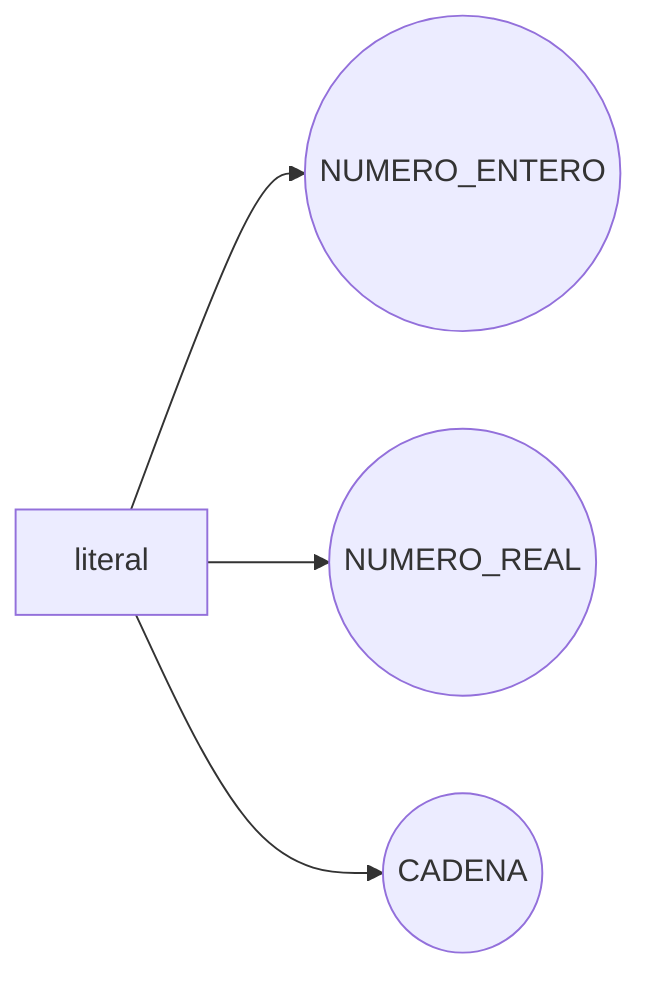
```mermaid
graph LR
    lit["literal"] --> ne(("NUMERO_ENTERO"))
    lit --> nr(("NUMERO_REAL"))
    lit --> ca(("CADENA"))
```

**Ejemplo:** `42`

**Árbol de Derivación:**

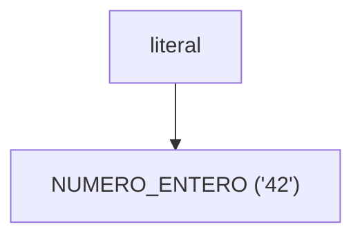
```mermaid
graph TD
    literal["literal"] --> ne2["NUMERO_ENTERO ('42')"]
```

---

## Nivel 2 — Identificadores

**GLC:**
```
id    → LETRA resto
resto → LETRA resto | DIGITO resto | '_' resto | ε
```

**Diagrama de Sintaxis:**

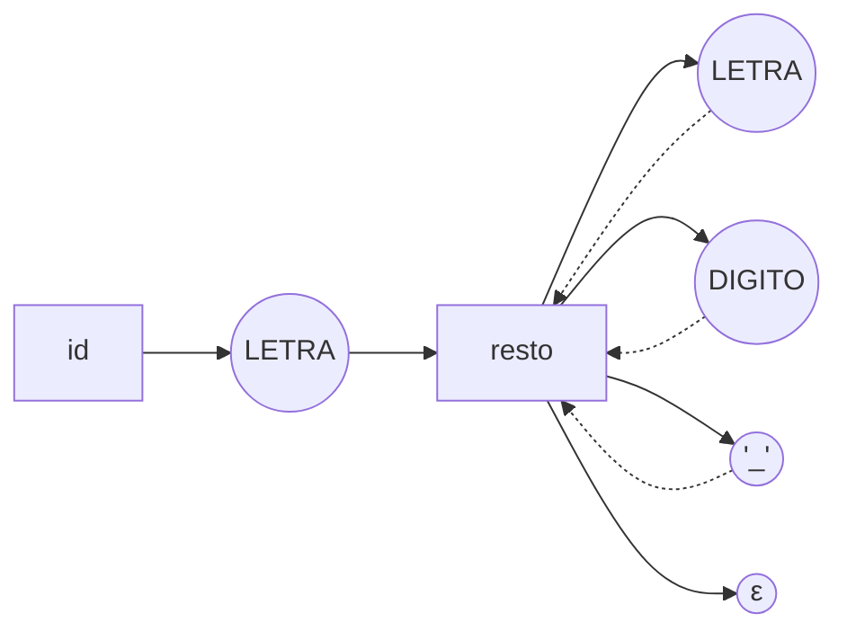
```mermaid
graph LR
    id["id"] --> letra(("LETRA"))
    letra --> resto["resto"]
    resto --> rletra(("LETRA"))
    resto --> rdigit(("DIGITO"))
    resto --> runder(("'_'"))
    resto --> reps(("ε"))
    rletra -.-> resto
    rdigit -.-> resto
    runder -.-> resto
```

**Ejemplo:** `x`

**Árbol de Derivación:**

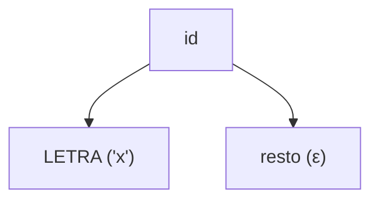
```mermaid
graph TD
    id["id"] --> letra["LETRA ('x')"]
    id --> resto["resto (ε)"]
```

---

## Nivel 3 — Declaración de variable

**GLC:**
```
declaracion → tipo ID ';'
tipo        → 'Entero' | 'Decimal' | 'Expresion' | 'Binario'
```

**Diagrama de Sintaxis:**

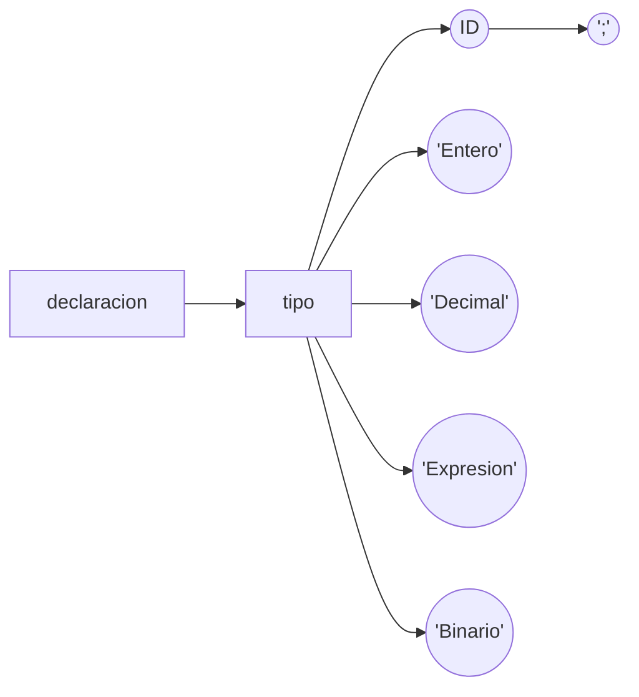
```mermaid
graph LR
    decl["declaracion"] --> tipo["tipo"]
    tipo --> id_t(("ID"))
    id_t --> sc(("';'"))

    tipo --> en(("'Entero'"))
    tipo --> de(("'Decimal'"))
    tipo --> ex(("'Expresion'"))
    tipo --> bi(("'Binario'"))
```

**Ejemplo:** `Entero x;`

**Árbol de Derivación:**

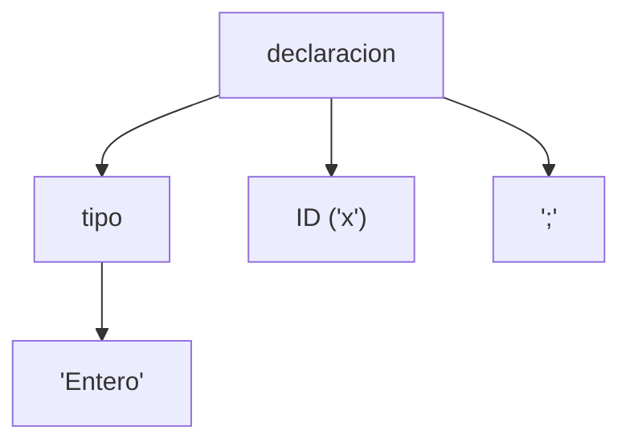
```mermaid
graph TD
    decl["declaracion"] --> tipo["tipo"]
    decl --> id["ID ('x')"]
    decl --> sc["';'"]
    tipo --> kw["'Entero'"]
```

---

## Nivel 4 — Asignación

**GLC:**
```
asignacion → ID '=' expresion ';'
expresion  → termino
termino    → factor
factor     → NUMERO_ENTERO | NUMERO_REAL | CADENA | ID | '(' expresion ')'
```

**Diagrama de Sintaxis:**

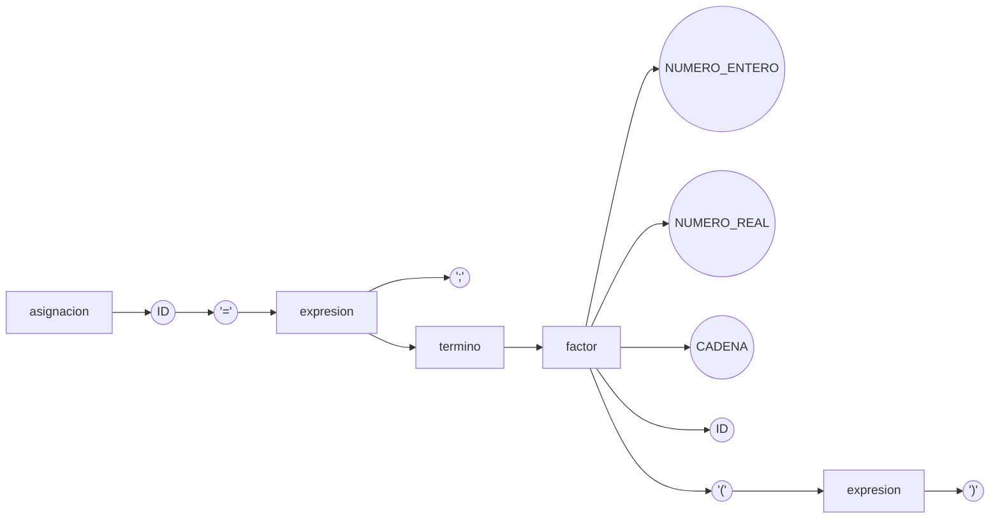
```mermaid
graph LR
    asig["asignacion"] --> id_a(("ID"))
    id_a --> eq(("'='"))
    eq --> expr["expresion"]
    expr --> sc(("';'"))

    expr --> term["termino"]
    term --> fact["factor"]

    fact --> ne(("NUMERO_ENTERO"))
    fact --> nr(("NUMERO_REAL"))
    fact --> ca(("CADENA"))
    fact --> id_f(("ID"))
    fact --> lp(("'('"))
    lp --> expr2["expresion"]
    expr2 --> rp(("')'"))
```

**Ejemplo:** `x = 10;`

**Árbol de Derivación:**

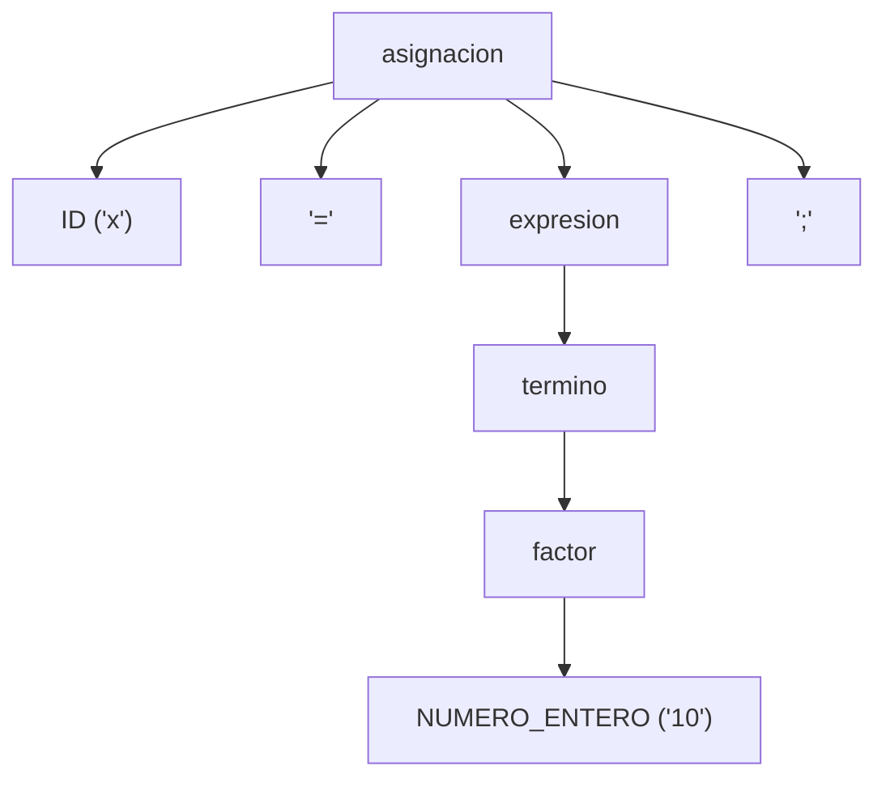
```mermaid
graph TD
    asig["asignacion"] --> id_x["ID ('x')"]
    asig --> eq["'='"]
    asig --> expr["expresion"]
    asig --> sc["';'"]
    expr --> term["termino"]
    term --> fact["factor"]
    fact --> num["NUMERO_ENTERO ('10')"]
```

---

## Nivel 5 — Declaración con asignación

**GLC:**
```
declaracion_asig → tipo ID '=' expresion ';'
tipo             → 'Entero' | 'Decimal' | 'Expresion' | 'Binario'
expresion        → termino
termino          → factor
factor           → NUMERO_ENTERO | NUMERO_REAL | CADENA | ID | '(' expresion ')'
```

**Diagrama de Sintaxis:**

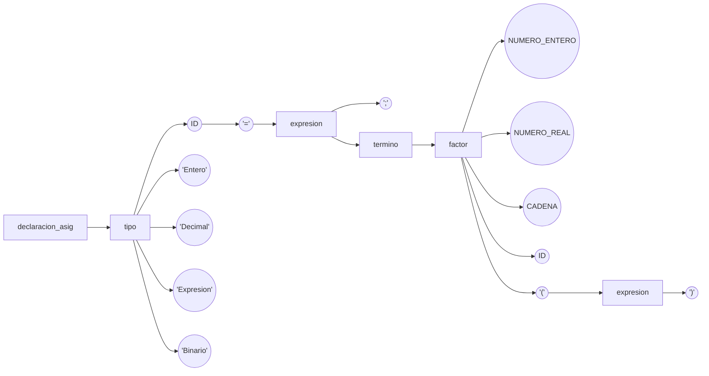
```mermaid
graph LR
    da["declaracion_asig"] --> tipo["tipo"]
    tipo --> id_da(("ID"))
    id_da --> eq(("'='"))
    eq --> expr["expresion"]
    expr --> sc(("';'"))

    tipo --> en(("'Entero'"))
    tipo --> de(("'Decimal'"))
    tipo --> ex(("'Expresion'"))
    tipo --> bi(("'Binario'"))

    expr --> term["termino"]
    term --> fact["factor"]
    fact --> ne(("NUMERO_ENTERO"))
    fact --> nr(("NUMERO_REAL"))
    fact --> ca(("CADENA"))
    fact --> id_f(("ID"))
    fact --> lp(("'('"))
    lp --> expr2["expresion"]
    expr2 --> rp(("')'"))
```

**Ejemplo:** `Decimal pi = 3.14;`

**Árbol de Derivación:**

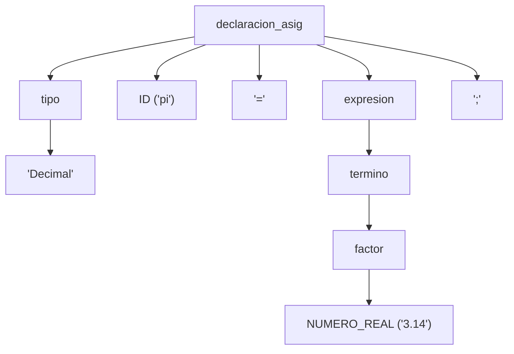
```mermaid
graph TD
    da["declaracion_asig"] --> tipo["tipo"]
    da --> id_pi["ID ('pi')"]
    da --> eq["'='"]
    da --> expr["expresion"]
    da --> sc["';'"]
    tipo --> dec_kw["'Decimal'"]
    expr --> term["termino"]
    term --> fact["factor"]
    fact --> nr["NUMERO_REAL ('3.14')"]
```

---

## Nivel 6 — Expresión aritmética

**GLC:**
```
expresion → expresion '+' termino
          | expresion '-' termino
          | termino
termino   → termino '*' factor
          | termino '/' factor
          | termino '**' factor
          | factor
factor    → NUMERO_ENTERO | NUMERO_REAL | ID | '(' expresion ')'
```

**Diagrama de Sintaxis:**

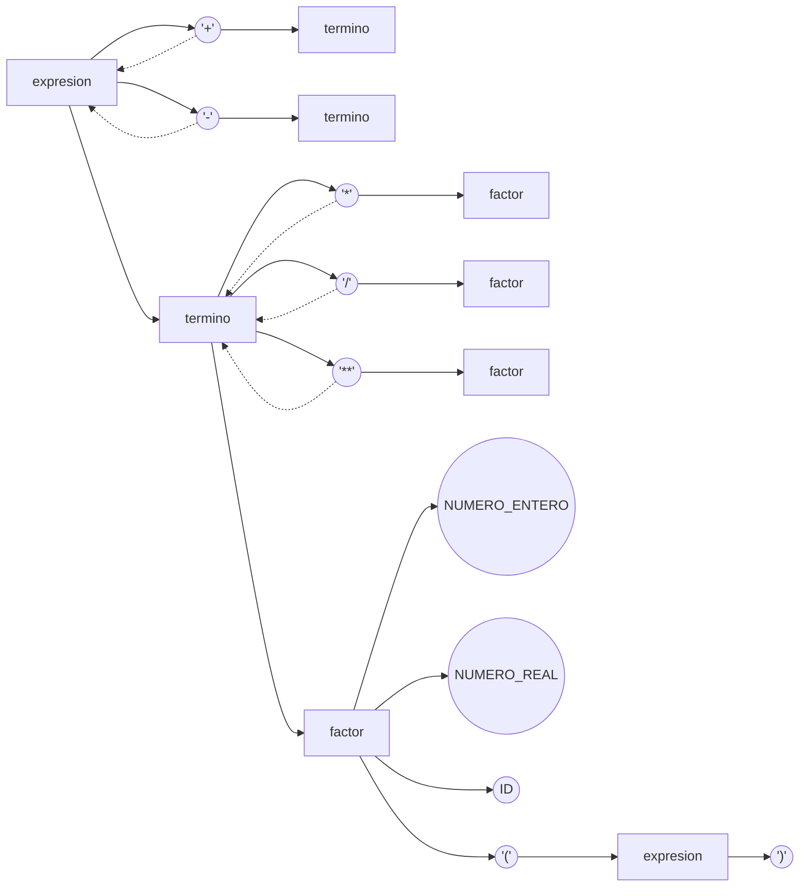
```mermaid
graph LR
    expr["expresion"] --> term["termino"]
    expr --> plus(("'+'"))
    plus --> term2["termino"]
    plus -.-> expr
    expr --> minus(("'-'"))
    minus --> term3["termino"]
    minus -.-> expr

    term["termino"] --> fact["factor"]
    term --> mul(("'*'"))
    mul --> fact2["factor"]
    mul -.-> term
    term --> div(("'/'"))
    div --> fact3["factor"]
    div -.-> term
    term --> pow(("'**'"))
    pow --> fact4["factor"]
    pow -.-> term

    fact["factor"] --> ne(("NUMERO_ENTERO"))
    fact --> nr(("NUMERO_REAL"))
    fact --> id_f(("ID"))
    fact --> lp(("'('"))
    lp --> expr2["expresion"]
    expr2 --> rp(("')'"))
```

**Ejemplo:** `(a + b) * c`

**Árbol de Derivación:**

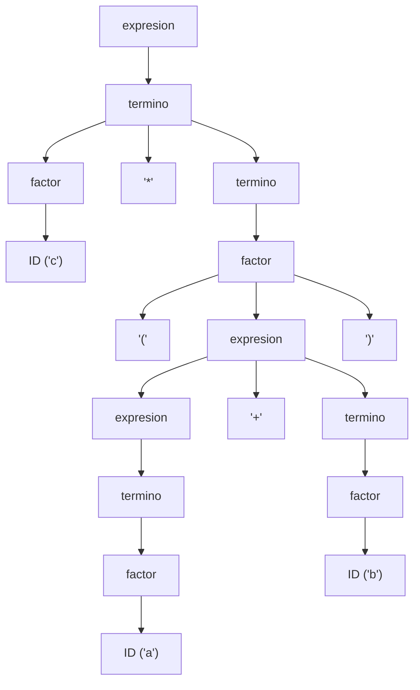
```mermaid
graph TD
    expr["expresion"] --> term_root["termino"]
    term_root --> term_left["termino"]
    term_root --> mul["'*'"]
    term_root --> fact_c["factor"]
    fact_c --> id_c["ID ('c')"]
    term_left --> fact_paren["factor"]
    fact_paren --> lp["'('"]
    fact_paren --> inner["expresion"]
    fact_paren --> rp["')'"]
    inner --> inner_expr["expresion"]
    inner --> plus["'+'"]
    inner --> term_b["termino"]
    inner_expr --> term_a["termino"]
    term_a --> fact_a["factor"]
    fact_a --> id_a["ID ('a')"]
    term_b --> fact_b["factor"]
    fact_b --> id_b["ID ('b')"]
```

---

## Nivel 7 — Asignación de expresión aritmética

**GLC:**
```
asignacion → ID '=' expresion ';'
expresion  → expresion '+' termino | expresion '-' termino | termino
termino    → factor
factor     → ID | NUMERO_ENTERO | NUMERO_REAL | '(' expresion ')'
```

**Diagrama de Sintaxis:**

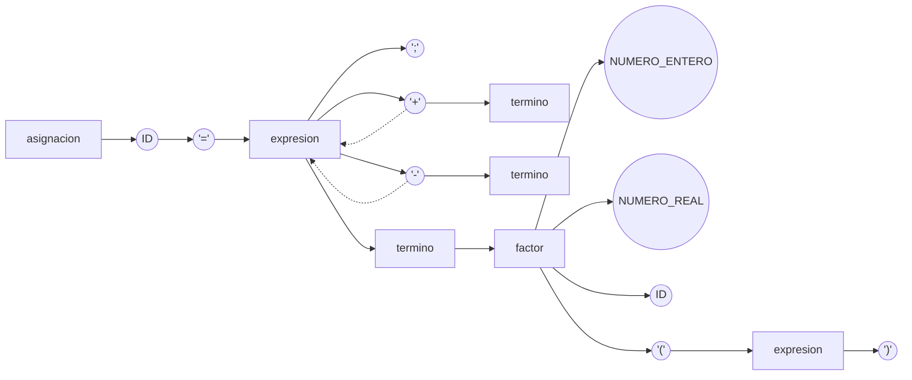
```mermaid
graph LR
    asig["asignacion"] --> id_a(("ID"))
    id_a --> eq(("'='"))
    eq --> expr["expresion"]
    expr --> sc(("';'"))

    expr --> term["termino"]
    expr --> plus(("'+'"))
    plus --> term2["termino"]
    plus -.-> expr
    expr --> minus(("'-'"))
    minus --> term3["termino"]
    minus -.-> expr

    term --> fact["factor"]
    fact --> ne(("NUMERO_ENTERO"))
    fact --> nr(("NUMERO_REAL"))
    fact --> id_f(("ID"))
    fact --> lp(("'('"))
    lp --> expr2["expresion"]
    expr2 --> rp(("')'"))
```

**Ejemplo:** `resultado = a + b;`

**Árbol de Derivación:**

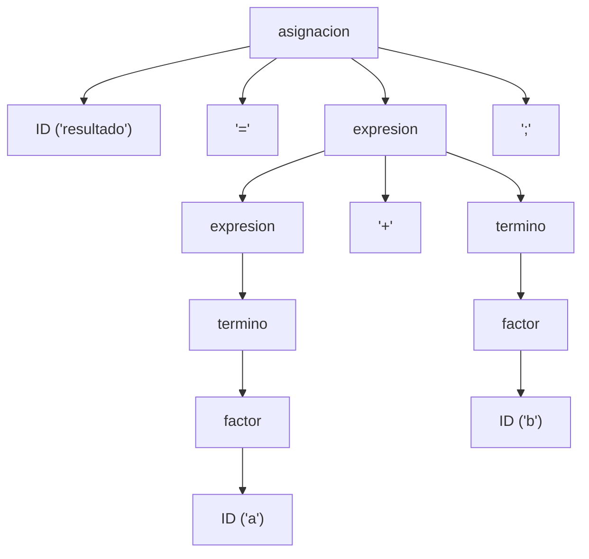
```mermaid
graph TD
    asig["asignacion"] --> id_res["ID ('resultado')"]
    asig --> eq["'='"]
    asig --> expr["expresion"]
    asig --> sc["';'"]
    expr --> expr_left["expresion"]
    expr --> plus["'+'"]
    expr --> term_b["termino"]
    expr_left --> term_a["termino"]
    term_a --> fact_a["factor"]
    fact_a --> id_a["ID ('a')"]
    term_b --> fact_b["factor"]
    fact_b --> id_b["ID ('b')"]
```

---

## Nivel 8 — Expresión relacional

**GLC:**
```
condicion  → expresion op_rel expresion
op_rel     → '==' | '!=' | '<' | '>' | '<=' | '>='
expresion  → termino
termino    → factor
factor     → ID | NUMERO_ENTERO
```

**Diagrama de Sintaxis:**

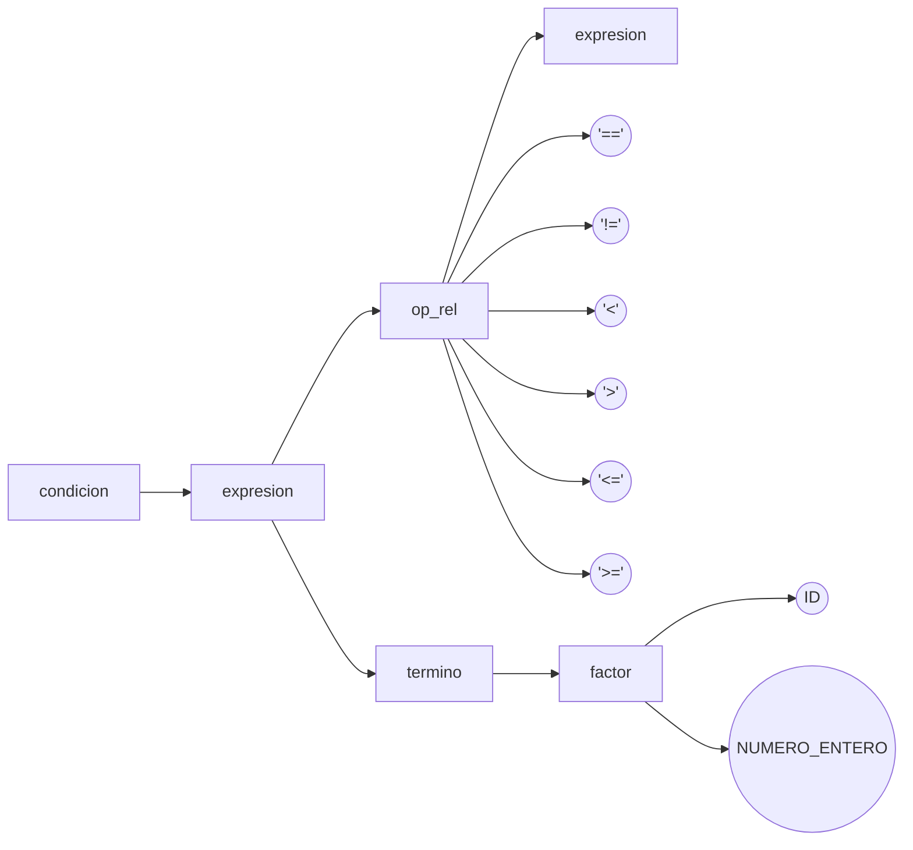
```mermaid
graph LR
    cond["condicion"] --> expr1["expresion"]
    expr1 --> oprel["op_rel"]
    oprel --> expr2["expresion"]

    oprel --> eq2(("'=='"))
    oprel --> neq(("'!='"))
    oprel --> lt(("'<'"))
    oprel --> gt(("'>'"))
    oprel --> lte(("'<='"))
    oprel --> gte(("'>='"))

    expr1 --> term1["termino"]
    term1 --> fact1["factor"]
    fact1 --> id_f(("ID"))
    fact1 --> ne(("NUMERO_ENTERO"))
```

**Ejemplo:** `x >= 18`

**Árbol de Derivación:**

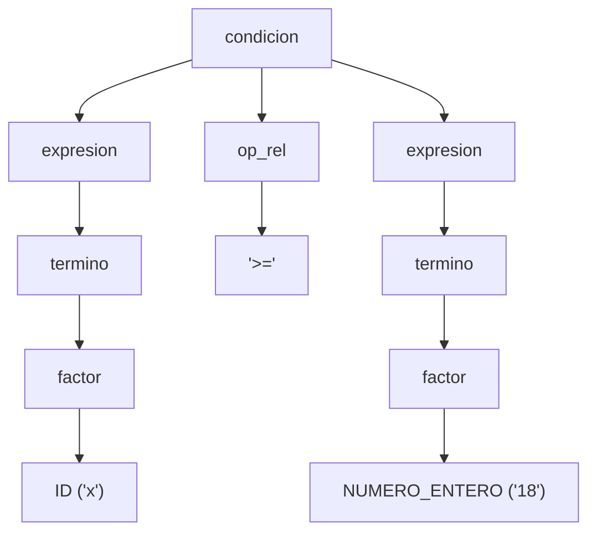
```mermaid
graph TD
    cond["condicion"] --> expr1["expresion"]
    cond --> op["op_rel"]
    cond --> expr2["expresion"]
    expr1 --> term1["termino"]
    term1 --> fact1["factor"]
    fact1 --> id_x["ID ('x')"]
    op --> ge["'>='"]
    expr2 --> term2["termino"]
    term2 --> fact2["factor"]
    fact2 --> num18["NUMERO_ENTERO ('18')"]
```

---

## Nivel 9 — Expresión lógica compuesta

**GLC:**
```
condicion → condicion '&' condicion
          | condicion '|' condicion
          | expresion op_rel expresion
op_rel    → '==' | '!=' | '<' | '>' | '<=' | '>='
```

**Diagrama de Sintaxis:**

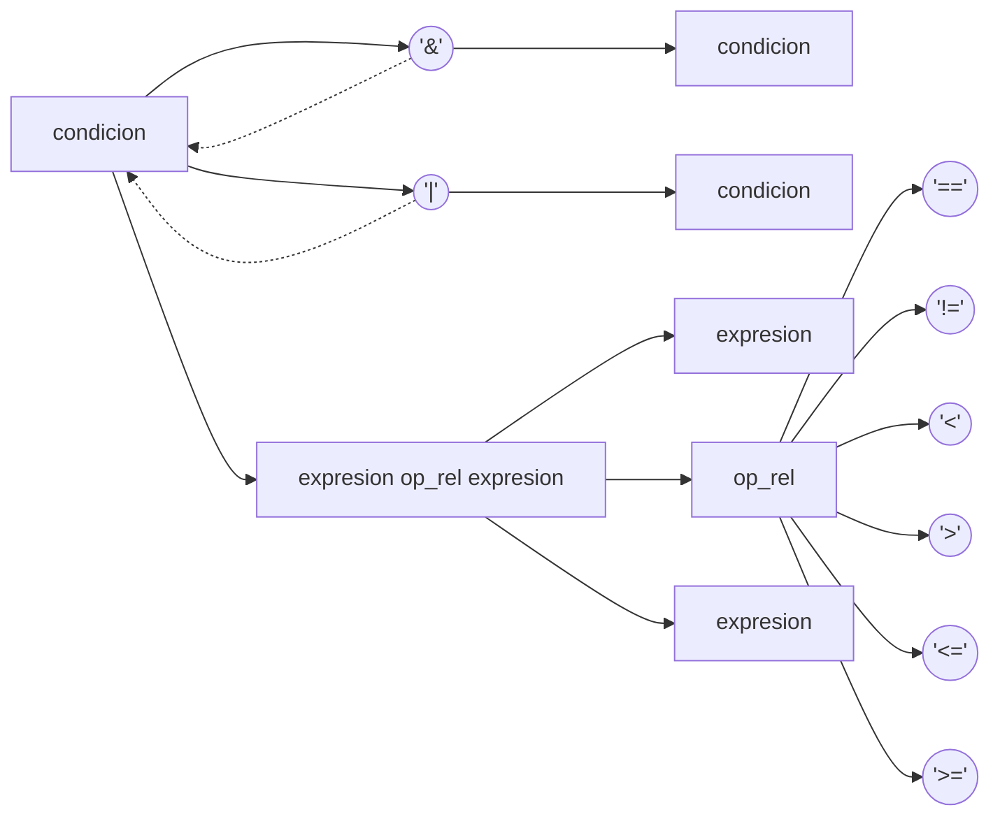
```mermaid
graph LR
    cond["condicion"] --> expr_rel["expresion op_rel expresion"]
    cond --> and_op(("'&'"))
    and_op --> cond2["condicion"]
    and_op -.-> cond
    cond --> or_op(("'|'"))
    or_op --> cond3["condicion"]
    or_op -.-> cond

    expr_rel --> e1["expresion"]
    expr_rel --> oprel["op_rel"]
    expr_rel --> e2["expresion"]

    oprel --> eq2(("'=='"))
    oprel --> neq(("'!='"))
    oprel --> lt(("'<'"))
    oprel --> gt(("'>'"))
    oprel --> lte(("'<='"))
    oprel --> gte(("'>='"))
```

**Ejemplo:** `x > 0 & y < 10`

**Árbol de Derivación:**

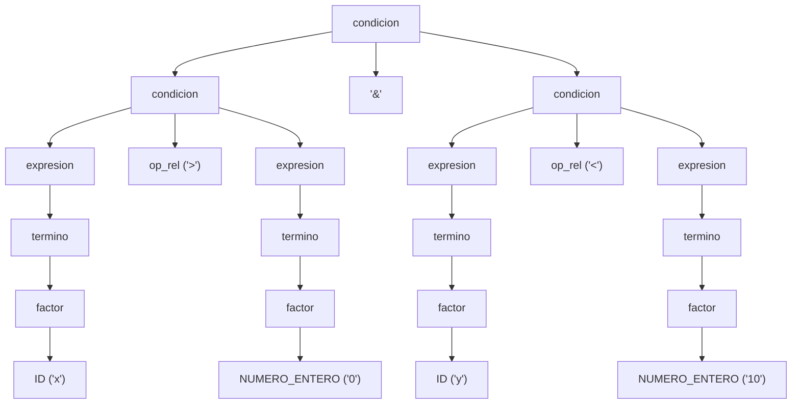
```mermaid
graph TD
    cond["condicion"] --> cond_l["condicion"]
    cond --> and_op["'&'"]
    cond --> cond_r["condicion"]
    cond_l --> e1["expresion"]
    cond_l --> op1["op_rel ('>')"]
    cond_l --> e2["expresion"]
    e1 --> t1["termino"]
    t1 --> f1["factor"]
    f1 --> id_x["ID ('x')"]
    e2 --> t2["termino"]
    t2 --> f2["factor"]
    f2 --> zero["NUMERO_ENTERO ('0')"]
    cond_r --> e3["expresion"]
    cond_r --> op2["op_rel ('<')"]
    cond_r --> e4["expresion"]
    e3 --> t3["termino"]
    t3 --> f3["factor"]
    f3 --> id_y["ID ('y')"]
    e4 --> t4["termino"]
    t4 --> f4["factor"]
    f4 --> ten["NUMERO_ENTERO ('10')"]
```

---

## Nivel 10 — Entrada y Salida

**GLC:**
```
salida    → 'Mostrar' argumento ';'
entrada   → 'Capturar' ID ';'
argumento → ID | CADENA | expresion
```

**Diagrama de Sintaxis — `salida`:**

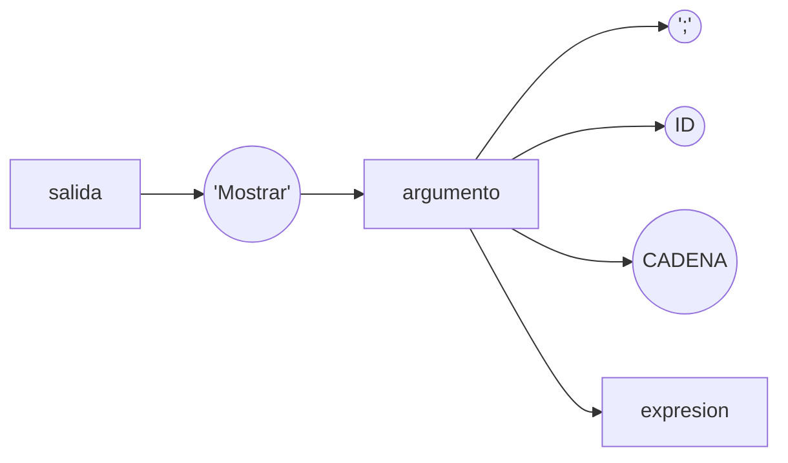
```mermaid
graph LR
    sal["salida"] --> mostrar(("'Mostrar'"))
    mostrar --> arg["argumento"]
    arg --> sc(("';'"))

    arg --> id_a(("ID"))
    arg --> ca(("CADENA"))
    arg --> expr["expresion"]
```

**Diagrama de Sintaxis — `entrada`:**

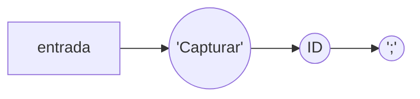
```mermaid
graph LR
    ent["entrada"] --> capturar(("'Capturar'"))
    capturar --> id_e(("ID"))
    id_e --> sc(("';'"))
```

**Ejemplo:** `Mostrar "Hola";`

**Árbol de Derivación:**

```mermaid
graph TD
    sal["salida"] --> kw_m["'Mostrar'"]
    sal --> arg["argumento"]
    sal --> sc1["';'"]
    arg --> str["CADENA ('Hola')"]
```

**Ejemplo:** `Capturar edad;`

**Árbol de Derivación:**

```mermaid
graph TD
    ent["entrada"] --> kw_c["'Capturar'"]
    ent --> id_e["ID ('edad')"]
    ent --> sc2["';'"]
```

---

## Nivel 11 — Estructura base del programa

**GLC:**
```
programa  → 'Inicio' cuerpo 'Final'
cuerpo    → sentencia cuerpo | ε
sentencia → declaracion | declaracion_asig | asignacion
          | salida | entrada | borrar | condicional | bucle
```

**Diagrama de Sintaxis — `programa`:**

```mermaid
graph LR
    prog["programa"] --> ini(("'Inicio'"))
    ini --> body["cuerpo"]
    body --> fin(("'Final'"))
```

**Diagrama de Sintaxis — `cuerpo` / `sentencia`:**

```mermaid
graph LR
    body["cuerpo"] --> sent["sentencia"]
    sent -.-> body
    body --> eps(("ε"))

    sent --> decl["declaracion"]
    sent --> decl_a["declaracion_asig"]
    sent --> asig["asignacion"]
    sent --> sal["salida"]
    sent --> ent["entrada"]
    sent --> bor["borrar"]
    sent --> cond["condicional"]
    sent --> loop["bucle"]
```

**Ejemplo:**
```
Inicio
    Entero x = 5;
    Mostrar x;
Final
```

**Árbol de Derivación:**

```mermaid
graph TD
    prog["programa"] --> ini["'Inicio'"]
    prog --> body["cuerpo"]
    prog --> fin["'Final'"]
    body --> s1["sentencia"]
    body --> body2["cuerpo"]
    s1 --> decl["declaracion_asig (Entero x = 5;)"]
    body2 --> s2["sentencia"]
    body2 --> eps["cuerpo (ε)"]
    s2 --> sal["salida (Mostrar x;)"]
```

---

## Nivel 12 — Condicional simple

**GLC:**
```
condicional → 'Si' condicion 'Entonces' cuerpo
cuerpo      → sentencia cuerpo | ε
condicion   → expresion op_rel expresion
```

**Diagrama de Sintaxis:**

```mermaid
graph LR
    cond_st["condicional"] --> si(("'Si'"))
    si --> cond["condicion"]
    cond --> entonces(("'Entonces'"))
    entonces --> body["cuerpo"]

    cond --> e1["expresion"]
    e1 --> oprel["op_rel"]
    oprel --> e2["expresion"]

    body --> sent["sentencia"]
    sent -.-> body
    body --> eps(("ε"))
```

**Ejemplo:**
```
Si x > 0 Entonces
    Mostrar "Positivo";
```

**Árbol de Derivación:**

```mermaid
graph TD
    cond_st["condicional"] --> si["'Si'"]
    cond_st --> cond["condicion"]
    cond_st --> entonces["'Entonces'"]
    cond_st --> body["cuerpo"]
    cond --> e1["expresion"]
    cond --> op["op_rel ('>')"]
    cond --> e2["expresion"]
    e1 --> t1["termino"]
    t1 --> f1["factor"]
    f1 --> id_x["ID ('x')"]
    e2 --> t2["termino"]
    t2 --> f2["factor"]
    f2 --> zero["NUMERO_ENTERO ('0')"]
    body --> s1["sentencia"]
    body --> eps["cuerpo (ε)"]
    s1 --> sal["salida (Mostrar 'Positivo';)"]
```

---

## Nivel 13 — Condicional con alternativa

**GLC:**
```
condicional → 'Si' condicion 'Entonces' cuerpo 'Sino' cuerpo
```

**Diagrama de Sintaxis:**

```mermaid
graph LR
    cond_st["condicional"] --> si(("'Si'"))
    si --> cond["condicion"]
    cond --> entonces(("'Entonces'"))
    entonces --> body1["cuerpo_1"]
    body1 --> sino(("'Sino'"))
    sino --> body2["cuerpo_2"]

    body1 --> s1["sentencia"]
    s1 -.-> body1
    body1 --> eps1(("ε"))

    body2 --> s2["sentencia"]
    s2 -.-> body2
    body2 --> eps2(("ε"))
```

**Ejemplo:**
```
Si edad >= 18 Entonces
    Mostrar "Mayor";
Sino
    Mostrar "Menor";
```

**Árbol de Derivación:**

```mermaid
graph TD
    cond_st["condicional"] --> si["'Si'"]
    cond_st --> cond["condicion"]
    cond_st --> entonces["'Entonces'"]
    cond_st --> body1["cuerpo_1"]
    cond_st --> sino["'Sino'"]
    cond_st --> body2["cuerpo_2"]
    cond --> e1["expresion"]
    cond --> op["op_rel ('>=')"]
    cond --> e2["expresion"]
    e1 --> id_edad["ID ('edad')"]
    e2 --> num18["NUMERO_ENTERO ('18')"]
    body1 --> s1["sentencia"]
    body1 --> eps1["cuerpo (ε)"]
    s1 --> sal1["salida (Mostrar 'Mayor';)"]
    body2 --> s2["sentencia"]
    body2 --> eps2["cuerpo (ε)"]
    s2 --> sal2["salida (Mostrar 'Menor';)"]
```

---

## Nivel 14 — Condicional anidado

**GLC:**
```
condicional → 'Si' condicion 'Entonces' cuerpo
            | 'Si' condicion 'Entonces' cuerpo 'Sino' cuerpo
cuerpo      → sentencia cuerpo | ε
sentencia   → condicional | ...
```

**Diagrama de Sintaxis:**

```mermaid
graph LR
    cond_o["condicional (externo)"] --> si_o(("'Si'"))
    si_o --> cond_oe["condicion"]
    cond_oe --> ent_o(("'Entonces'"))
    ent_o --> body_o1["cuerpo_1"]
    body_o1 --> sino_o(("'Sino'"))
    sino_o --> body_o2["cuerpo_2"]

    body_o2 --> cond_i["condicional (interno)"]
    cond_i --> si_i(("'Si'"))
    si_i --> cond_ie["condicion"]
    cond_ie --> ent_i(("'Entonces'"))
    ent_i --> body_i1["cuerpo_1"]
    body_i1 --> sino_i(("'Sino'"))
    sino_i --> body_i2["cuerpo_2"]
```

**Ejemplo:**
```
Si x > 0 Entonces
    Mostrar "Positivo";
Sino
    Si x == 0 Entonces
        Mostrar "Cero";
    Sino
        Mostrar "Negativo";
```

**Árbol de Derivación:**

```mermaid
graph TD
    outer["condicional (Si x > 0)"] --> ocond["condicion (x > 0)"]
    outer --> oent["'Entonces'"]
    outer --> obody1["cuerpo_1"]
    outer --> osino["'Sino'"]
    outer --> obody2["cuerpo_2"]
    obody1 --> os1["salida (Mostrar 'Positivo';)"]
    obody1 --> oeps["cuerpo (ε)"]
    obody2 --> inner["condicional (Si x == 0)"]
    obody2 --> oeps2["cuerpo (ε)"]
    inner --> icond["condicion (x == 0)"]
    inner --> ient["'Entonces'"]
    inner --> ibody1["cuerpo_1"]
    inner --> isino["'Sino'"]
    inner --> ibody2["cuerpo_2"]
    ibody1 --> is1["salida (Mostrar 'Cero';)"]
    ibody1 --> ieps1["cuerpo (ε)"]
    ibody2 --> is2["salida (Mostrar 'Negativo';)"]
    ibody2 --> ieps2["cuerpo (ε)"]
```

---

## Nivel 15 — Bucle

**GLC:**
```
bucle  → 'Mientras' condicion 'Hacer' cuerpo
cuerpo → sentencia cuerpo | ε
```

**Diagrama de Sintaxis:**

```mermaid
graph LR
    loop["bucle"] --> mien(("'Mientras'"))
    mien --> cond["condicion"]
    cond --> hacer(("'Hacer'"))
    hacer --> body["cuerpo"]

    body --> sent["sentencia"]
    sent -.-> body
    body --> eps(("ε"))

    cond --> e1["expresion"]
    e1 --> oprel["op_rel"]
    oprel --> e2["expresion"]
```

**Ejemplo:**
```
Mientras x < 10 Hacer
    x = x + 1;
```

**Árbol de Derivación:**

```mermaid
graph TD
    loop["bucle"] --> mien["'Mientras'"]
    loop --> cond["condicion"]
    loop --> hacer["'Hacer'"]
    loop --> body["cuerpo"]
    cond --> e1["expresion"]
    cond --> op["op_rel ('<')"]
    cond --> e2["expresion"]
    e1 --> f1["factor"]
    f1 --> id_x1["ID ('x')"]
    e2 --> f2["factor"]
    f2 --> num10["NUMERO_ENTERO ('10')"]
    body --> s1["sentencia"]
    body --> eps["cuerpo (ε)"]
    s1 --> asig["asignacion (x = x + 1;)"]
```

---

## Nivel 16 — Bucle con cuerpo complejo

**GLC:**
```
bucle  → 'Mientras' condicion 'Hacer' cuerpo
cuerpo → sentencia cuerpo | ε
```

**Diagrama de Sintaxis:**

```mermaid
graph LR
    loop["bucle"] --> mien(("'Mientras'"))
    mien --> cond["condicion"]
    cond --> hacer(("'Hacer'"))
    hacer --> body["cuerpo"]

    body --> sent1["sentencia (salida)"]
    body --> body2["cuerpo"]
    body2 --> sent2["sentencia (asignacion)"]
    body2 --> eps(("ε"))

    sent1 --> mostrar(("'Mostrar'"))
    mostrar --> arg["argumento"]
    arg --> sc1(("';'"))

    sent2 --> id_s(("ID"))
    id_s --> eq(("'='"))
    eq --> expr["expresion"]
    expr --> sc2(("';'"))
```

**Ejemplo:**
```
Entero i = 0;
Mientras i < 5 Hacer
    Mostrar i;
    i = i + 1;
```

**Árbol de Derivación:**

```mermaid
graph TD
    seq["secuencia"] --> decl["declaracion_asig (Entero i = 0;)"]
    seq --> loop["bucle"]
    loop --> mien["'Mientras'"]
    loop --> cond["condicion (i < 5)"]
    loop --> hacer["'Hacer'"]
    loop --> body["cuerpo"]
    body --> s1["sentencia"]
    body --> body2["cuerpo"]
    s1 --> sal["salida (Mostrar i;)"]
    body2 --> s2["sentencia"]
    body2 --> eps["cuerpo (ε)"]
    s2 --> asig["asignacion (i = i + 1;)"]
```

---

## Nivel 17 — Borrar variable

**GLC:**
```
borrar → 'Borrar' ID ';'
```

**Diagrama de Sintaxis:**

```mermaid
graph LR
    bor["borrar"] --> borrar_kw(("'Borrar'"))
    borrar_kw --> id_b(("ID"))
    id_b --> sc(("';'"))
```

**Ejemplo:** `Borrar x;`

**Árbol de Derivación:**

```mermaid
graph TD
    bor["borrar"] --> kw["'Borrar'"]
    bor --> id_x["ID ('x')"]
    bor --> sc["';'"]
```

---

## Nivel 18 — Programa completo con condicional

**GLC:**
```
programa    → 'Inicio' cuerpo 'Final'
cuerpo      → sentencia cuerpo | ε
sentencia   → declaracion | entrada | condicional | salida
condicional → 'Si' condicion 'Entonces' cuerpo
            | 'Si' condicion 'Entonces' cuerpo 'Sino' cuerpo
```

**Diagrama de Sintaxis:**

```mermaid
graph LR
    prog["programa"] --> ini(("'Inicio'"))
    ini --> body["cuerpo"]
    body --> fin(("'Final'"))

    body --> s_decl["declaracion"]
    body --> s_ent["entrada"]
    body --> s_cond["condicional"]
    body --> s_sal["salida"]
    body --> eps(("ε"))

    s_cond --> si(("'Si'"))
    si --> cond["condicion"]
    cond --> entonces(("'Entonces'"))
    entonces --> body1["cuerpo_1"]
    body1 --> sino(("'Sino'"))
    sino --> body2["cuerpo_2"]
```

**Ejemplo:**
```
Inicio
    Entero x;
    Capturar x;
    Si x > 0 Entonces
        Mostrar "Positivo";
    Sino
        Mostrar "No positivo";
Final
```

**Árbol de Derivación:**

```mermaid
graph TD
    prog["programa"] --> ini["'Inicio'"]
    prog --> body["cuerpo"]
    prog --> fin["'Final'"]
    body --> s1["sentencia"]
    body --> body2["cuerpo"]
    s1 --> decl["declaracion (Entero x;)"]
    body2 --> s2["sentencia"]
    body2 --> body3["cuerpo"]
    s2 --> cap["entrada (Capturar x;)"]
    body3 --> s3["sentencia"]
    body3 --> eps["cuerpo (ε)"]
    s3 --> cond_st["condicional"]
    cond_st --> si["'Si'"]
    cond_st --> cond["condicion (x > 0)"]
    cond_st --> entonces["'Entonces'"]
    cond_st --> cb1["cuerpo_1"]
    cond_st --> sino["'Sino'"]
    cond_st --> cb2["cuerpo_2"]
    cb1 --> sal1["salida (Mostrar 'Positivo';)"]
    cb1 --> ceps1["cuerpo (ε)"]
    cb2 --> sal2["salida (Mostrar 'No positivo';)"]
    cb2 --> ceps2["cuerpo (ε)"]
```

---

## Nivel 19 — Programa con bucle (acumulador)

**GLC:**
```
programa  → 'Inicio' cuerpo 'Final'
cuerpo    → sentencia cuerpo | ε
sentencia → declaracion_asig | bucle | salida
bucle     → 'Mientras' condicion 'Hacer' cuerpo
```

**Diagrama de Sintaxis:**

```mermaid
graph LR
    prog["programa"] --> ini(("'Inicio'"))
    ini --> body["cuerpo"]
    body --> fin(("'Final'"))

    body --> s_da["declaracion_asig"]
    body --> s_loop["bucle"]
    body --> s_sal["salida"]
    body --> eps(("ε"))

    s_loop --> mien(("'Mientras'"))
    mien --> cond["condicion"]
    cond --> hacer(("'Hacer'"))
    hacer --> lbody["cuerpo"]

    lbody --> lb_asig["asignacion"]
    lb_asig -.-> lbody
    lbody --> leps(("ε"))
```

**Ejemplo:**
```
Inicio
    Entero suma = 0;
    Entero i = 1;
    Mientras i <= 10 Hacer
        suma = suma + i;
        i = i + 1;
    Mostrar suma;
Final
```

**Árbol de Derivación:**

```mermaid
graph TD
    prog["programa"] --> ini["'Inicio'"]
    prog --> body["cuerpo"]
    prog --> fin["'Final'"]
    body --> d1["declaracion_asig (Entero suma = 0;)"]
    body --> body2["cuerpo"]
    body2 --> d2["declaracion_asig (Entero i = 1;)"]
    body2 --> body3["cuerpo"]
    body3 --> loop["bucle"]
    body3 --> body4["cuerpo"]
    loop --> mien["'Mientras'"]
    loop --> cond["condicion (i <= 10)"]
    loop --> hacer["'Hacer'"]
    loop --> lbody["cuerpo"]
    lbody --> la1["asignacion (suma = suma + i;)"]
    lbody --> lbody2["cuerpo"]
    lbody2 --> la2["asignacion (i = i + 1;)"]
    lbody2 --> leps["cuerpo (ε)"]
    body4 --> sal["salida (Mostrar suma;)"]
    body4 --> eps["cuerpo (ε)"]
```

---

## Nivel 20 — Programa Turing-completo (búsqueda lineal)

**GLC:**
```
programa    → 'Inicio' cuerpo 'Final'
cuerpo      → sentencia cuerpo | ε
sentencia   → declaracion | declaracion_asig | asignacion
            | entrada | salida | bucle | condicional | borrar
bucle       → 'Mientras' condicion 'Hacer' cuerpo
condicional → 'Si' condicion 'Entonces' cuerpo
            | 'Si' condicion 'Entonces' cuerpo 'Sino' cuerpo
condicion   → expresion op_rel expresion
            | condicion '&' condicion
            | condicion '|' condicion
```

**Diagrama de Sintaxis:**

```mermaid
graph LR
    prog["programa"] --> ini(("'Inicio'"))
    ini --> body["cuerpo"]
    body --> fin(("'Final'"))

    body --> sent["sentencia"]
    sent -.-> body
    body --> eps(("ε"))

    sent --> decl["declaracion"]
    sent --> decl_a["declaracion_asig"]
    sent --> asig["asignacion"]
    sent --> ent["entrada"]
    sent --> sal["salida"]
    sent --> bor["borrar"]
    sent --> loop["bucle"]
    sent --> cond_st["condicional"]

    loop --> mien(("'Mientras'"))
    mien --> cond_l["condicion"]
    cond_l --> hacer(("'Hacer'"))
    hacer --> lbody["cuerpo del bucle"]

    cond_st --> si(("'Si'"))
    si --> cond_c["condicion"]
    cond_c --> entonces(("'Entonces'"))
    entonces --> cb1["cuerpo_1"]
    cb1 --> sino(("'Sino'"))
    sino --> cb2["cuerpo_2"]

    cond_l --> e1["expresion"]
    e1 --> oprel["op_rel"]
    oprel --> e2["expresion"]
    cond_l --> and_op(("'&'"))
    and_op --> cond_r["condicion"]
    and_op -.-> cond_l
```

**Ejemplo:**
```
Inicio
    Entero n; Entero objetivo;
    Entero i = 1; Entero encontrado = 0;
    Capturar n; Capturar objetivo;
    Mientras i <= n & encontrado == 0 Hacer
        Entero actual;
        Capturar actual;
        Si actual == objetivo Entonces
            encontrado = 1;
        i = i + 1;
    Si encontrado == 1 Entonces
        Mostrar "Encontrado";
    Sino
        Mostrar "No encontrado";
    Borrar actual;
Final
```

**Árbol de Derivación:**

```mermaid
graph TD
    prog["programa"] --> ini["'Inicio'"]
    prog --> body["cuerpo"]
    prog --> fin["'Final'"]
    body --> d1["declaracion (Entero n;)"]
    body --> body2["cuerpo"]
    body2 --> d2["declaracion (Entero objetivo;)"]
    body2 --> body3["cuerpo"]
    body3 --> d3["declaracion_asig (Entero i = 1;)"]
    body3 --> body4["cuerpo"]
    body4 --> d4["declaracion_asig (Entero encontrado = 0;)"]
    body4 --> body5["cuerpo"]
    body5 --> cap1["entrada (Capturar n;)"]
    body5 --> body6["cuerpo"]
    body6 --> cap2["entrada (Capturar objetivo;)"]
    body6 --> body7["cuerpo"]
    body7 --> loop["bucle (Mientras)"]
    body7 --> body8["cuerpo"]
    loop --> mien["'Mientras'"]
    loop --> cond_comp["condicion compuesta"]
    loop --> hacer["'Hacer'"]
    loop --> lbody["cuerpo del bucle"]
    cond_comp --> cl["condicion (i <= n)"]
    cond_comp --> and_op["'&'"]
    cond_comp --> cr["condicion (encontrado == 0)"]
    lbody --> ld1["declaracion (Entero actual;)"]
    lbody --> lbody2["cuerpo"]
    lbody2 --> lcap["entrada (Capturar actual;)"]
    lbody2 --> lbody3["cuerpo"]
    lbody3 --> inner_if["condicional (Si actual == objetivo)"]
    lbody3 --> lbody4["cuerpo"]
    inner_if --> ia["condicion (actual == objetivo)"]
    inner_if --> ient["'Entonces'"]
    inner_if --> ib["cuerpo (encontrado = 1;)"]
    lbody4 --> inc_i["asignacion (i = i + 1;)"]
    lbody4 --> leps["cuerpo (ε)"]
    body8 --> outer_if["condicional (Si encontrado == 1)"]
    body8 --> body9["cuerpo"]
    outer_if --> oa["condicion (encontrado == 1)"]
    outer_if --> oent["'Entonces'"]
    outer_if --> ob1["cuerpo_1 (Mostrar 'Encontrado';)"]
    outer_if --> osino["'Sino'"]
    outer_if --> ob2["cuerpo_2 (Mostrar 'No encontrado';)"]
    body9 --> bor["borrar (Borrar actual;)"]
    body9 --> eps["cuerpo (ε)"]
```

---

## Gramática Completa del Lenguaje (GLC)

```
programa         → 'Inicio' cuerpo 'Final'

cuerpo           → sentencia cuerpo | ε

sentencia        → declaracion
                 | declaracion_asig
                 | asignacion
                 | condicional
                 | bucle
                 | salida
                 | entrada
                 | borrar

declaracion      → tipo ID ';'
declaracion_asig → tipo ID '=' expresion ';'
tipo             → 'Entero' | 'Decimal' | 'Expresion' | 'Binario'

asignacion       → ID '=' expresion ';'

condicional      → 'Si' condicion 'Entonces' cuerpo
                 | 'Si' condicion 'Entonces' cuerpo 'Sino' cuerpo

bucle            → 'Mientras' condicion 'Hacer' cuerpo

salida           → 'Mostrar' argumento ';'
entrada          → 'Capturar' ID ';'
borrar           → 'Borrar' ID ';'

argumento        → ID | CADENA | expresion

condicion        → expresion op_rel expresion
                 | condicion '&' condicion
                 | condicion '|' condicion

expresion        → expresion '+' termino
                 | expresion '-' termino
                 | termino

termino          → termino '*' factor
                 | termino '/' factor
                 | termino '**' factor
                 | factor

factor           → NUMERO_ENTERO
                 | NUMERO_REAL
                 | CADENA
                 | ID
                 | '(' expresion ')'

op_rel           → '==' | '!=' | '<' | '>' | '<=' | '>='
```
